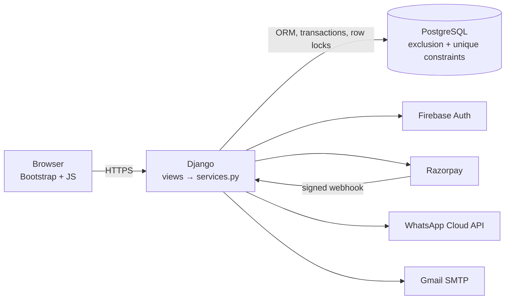

# Champions Club Platform

One web system for a sports club that today runs on WhatsApp, Excel and paper: **court bookings, members, a gear shop, a bar and cafe, a public website with enquiries, and the owner's money view**, all on one PostgreSQL database and one money ledger.

Built with Django, PostgreSQL, Bootstrap and a little JavaScript: simple, standard tools, with the hard rules enforced where they can't be bypassed.

## The problem

| Today | What goes wrong |
|---|---|
| Court bookings by WhatsApp and phone | Double bookings, lost time |
| Members in Excel | No plan rules, nobody notices expiry |
| Bar on paper | Lost tabs, forgotten discounts |
| Shop with no stock view | Selling what isn't there |
| No website | Lost enquiries |
| No money view | The owner can't say what the club earned, from where |

## What we built

| Area | What it does |
|---|---|
| **Court booking** | Live court grid (courts × 30-minute starts), 1-hour sessions, member or walk-in, price by plan, free hours, max 2 bookings per member per day, cancel with a 24 h refund window, Friday social play with a capacity |
| **Members** | Front-desk sign-up, Gold / Silver / Junior plans (Junior needs an adult guardian), automatic expiry status, renewal with payment, reminders at 14 / 7 / 1 days, search by name or phone, profile with history |
| **Shop** | Products with sizes, counter sales and online orders (pickup or delivery) from **the same stock**, member discount, low-stock alerts, restocking |
| **Bar and cafe** | Tables and tabs, kitchen and bar ticket screens, **automatic member discount line**, split payment across cash / card / UPI, shifts with cash check, day report |
| **Public website** | Club info, plans comparison, free courts for the week, shop, trial booking, enquiry form with spam protection |
| **Leads** | Every enquiry becomes a lead, auto-assigned and emailed, status pipeline, overdue follow-ups, one-click "register as member" |
| **Money** | One append-only ledger; owner dashboard (today / week / month vs previous), revenue by source × method, amounts owed, analytics (trend, utilisation, peak hours), CSV export |
| **Payments** | Cash / card / UPI at the desk, Razorpay (test mode) online with signature check and webhook |
| **Messages** | WhatsApp templates (Meta Cloud API) with email fallback, delivery log, retries, reminders 2 h before play |
| **Admin side** | GST invoices (CGST/SGST), monthly GST summary, employees, payroll, leave requests and approval |
| **Login** | Google sign-in through Firebase; roles: owner, front desk, bar staff, shop staff, member |

## What makes it technically strong

Each of these is a rule that **cannot be broken by a race, a double-click or a retry**, and each has a test that proves it.

1. **No double booking, enforced by PostgreSQL.** An `ExclusionConstraint` (`btree_gist`) on `(court, TSTZRANGE(start, end))` refuses overlapping confirmed bookings inside the database. Test: 50 threads book the same slot at the same instant → exactly 1 succeeds, 49 get "Court 2 is taken at 18:00".
2. **Max 2 bookings per day under concurrency.** The booking runs in `transaction.atomic()` with `select_for_update()` on the member row, so two simultaneous requests can't both see "1 booking". Test: one member races for 5 slots → exactly 2.
3. **Friday social play reuses the same guarantee.** A session creates a whole-court booking for its hour, so the existing constraint blocks clashes. Joining locks the session row: 20 simultaneous joins for 12 places → exactly 12.
4. **Stock can't go negative.** `UPDATE ... SET stock = stock - q WHERE stock >= q` (`filter(stock__gte=q).update(stock=F("stock") - q)`); 0 rows updated = out of stock. Test: 10 buyers (counter and online) for the last pair → 1 order.
5. **One ledger, append-only.** Every payment, refund and expense is one row written by one service; rows refuse edits and deletes. The dashboard only sums this table, so it always equals the daily reports (tested).
6. **Payments counted exactly once.** Razorpay signatures are checked with HMAC-SHA256 and `compare_digest`; the payment row is locked and `razorpay_payment_id` is unique. Test: 10 simultaneous captures (callback + webhook retries) → 1 ledger row.
7. **One pricing function** (`members/pricing.py: price_for`) for courts, shop and bar. Integer paise, no floats; expired members fall back to walk-in prices automatically; the price is frozen on the booking or order line.
8. **Messages never break bookings.** WhatsApp/email go out via `transaction.on_commit`; every attempt is logged, and failures fall back to email and can be retried.
9. **Database-level rules elsewhere too:** one open tab per table, one open shift per person, unique payroll per employee per month, unique invoice numbers with retry.

**249 automated tests** (Django `TestCase`, real PostgreSQL, real threads for the concurrency tests).

## Architecture



Full diagrams (technologies, app dependencies, booking sequence) and the reason for each technology choice: [docs/ARCHITECTURE.md](docs/ARCHITECTURE.md). Decisions and explanations per milestone: [docs/NOTES.md](docs/NOTES.md).

| App | Owns |
|---|---|
| `accounts` | Google login, roles, `role_required` |
| `members` | plans, members, memberships, `price_for`, demo data |
| `courts` | booking engine, court grid, social play |
| `shop` | products, stock, orders |
| `bar` | menu, tabs, kitchen screens, shifts |
| `finance` | ledger, Razorpay, dashboard, analytics, invoices, GST |
| `crm` | public website, enquiries, leads |
| `staffing` | employees, payroll, leave |
| `notifications` | WhatsApp/email delivery and log |

Business rules live in each app's `services.py`; views only read the request, call a service and render.

## Tech stack

Python 3.12 · Django 6 · PostgreSQL 16 · Django templates + Bootstrap 5 · Chart.js · pandas · Firebase Authentication (`firebase-admin`) · Razorpay SDK (test mode) · WhatsApp Cloud API (`requests`) · Gmail SMTP · python-dotenv.

## Run it locally

Requirements: Python 3.12, PostgreSQL 16 (with the `postgres` superuser, needed once to enable `btree_gist`).

```bash
git clone <repo> && cd HVYP
python -m venv .venv
.venv\Scripts\pip install -r requirements.txt
copy .env.example .env
```

Edit `.env`: set `DJANGO_SECRET_KEY`, `DB_PASSWORD`, and the Firebase values (see below). Then:

```bash
createdb -U postgres champions_club
.venv\Scripts\python manage.py migrate
.venv\Scripts\python manage.py seed_demo
.venv\Scripts\python manage.py createsuperuser
.venv\Scripts\python manage.py runserver
```

Open **http://localhost:8000** (use `localhost`, not `127.0.0.1`, for Google sign-in). Sign in with Google, then in `/admin/` → Users set your role to `owner`.

### Configuration (`.env`)

| Variable | Needed for |
|---|---|
| `DJANGO_SECRET_KEY`, `DJANGO_DEBUG`, `DJANGO_ALLOWED_HOSTS` | Django |
| `DB_NAME`, `DB_USER`, `DB_PASSWORD`, `DB_HOST`, `DB_PORT`, `DB_SSLMODE` | PostgreSQL (`require` for Neon) |
| `FIREBASE_CREDENTIALS_PATH` (service-account JSON, never committed), `FIREBASE_WEB_API_KEY`, `FIREBASE_AUTH_DOMAIN`, `FIREBASE_PROJECT_ID`, `GOOGLE_OAUTH_CLIENT_ID` | Google login |
| `RAZORPAY_KEY_ID`, `RAZORPAY_KEY_SECRET`, `RAZORPAY_WEBHOOK_SECRET` | Online payments (test keys `rzp_test_…`) |
| `WHATSAPP_TOKEN`, `WHATSAPP_PHONE_NUMBER_ID` | WhatsApp (empty = email only) |
| `EMAIL_BACKEND`, `EMAIL_HOST_USER`, `EMAIL_HOST_PASSWORD` | Gmail SMTP (app password); console by default |
| `CLUB_PHONE`, `CLUB_EMAIL`, `CLUB_ADDRESS` | Public website contact details |

### Tests

```bash
.venv\Scripts\python manage.py test
```

### Scheduled jobs (cron in production)

| Command | When |
|---|---|
| `manage.py send_booking_reminders` | every 15 minutes |
| `manage.py retry_notifications` | every 30 minutes |
| `manage.py send_renewal_reminders` | daily, 06:00 |

## Screens

Public: `/` home · `/plans/` · `/courts/availability/` · `/shop/` · `/trial/` · `/enquiry/`
Staff (`/desk/` after login): court grid `/desk/book/` · social play · members · leads · messages · shop counter, orders, stock · bar tables, kitchen screen, shift, day report
Owner: dashboard `/owner/dashboard/` · invoices · GST summary · payroll · leave approvals

Demo script with the strongest moments first: [docs/DEMO.md](docs/DEMO.md). Deployment: [docs/DEPLOY.md](docs/DEPLOY.md).

## Limitations and future work

- **Online refunds** are recorded in the ledger but the money is returned from the Razorpay dashboard (no refund API call yet).
- **No 5-minute payment hold:** an online booking is confirmed and marked unpaid until Razorpay confirms; an abandoned payment leaves an unpaid booking for staff to settle or cancel.
- **Member self-service booking** isn't built; members book through the front desk (the public site shows availability and takes trial bookings).
- **GST summary** covers invoices only; counter, bar and court prices are treated as GST-inclusive and not split out.
- **Payroll** is a flat 12% deduction; no PF/ESI/TDS filing (out of scope in the PRD).
- **Rate limiting** uses Django's per-process cache; several server processes would need a shared cache.
- **Kitchen screen** refreshes every 10 s instead of pushing updates (no websockets).
- **Bar shift takings** assume one till (the ledger has no staff column).
- No audit log table for overrides (the ledger, decided_by on leave and created_by on bookings cover the main money and decisions).
- Next steps: member portal booking with Razorpay hold, waitlist, recurring bookings, refund API, audit log, PWA for staff tablets.
