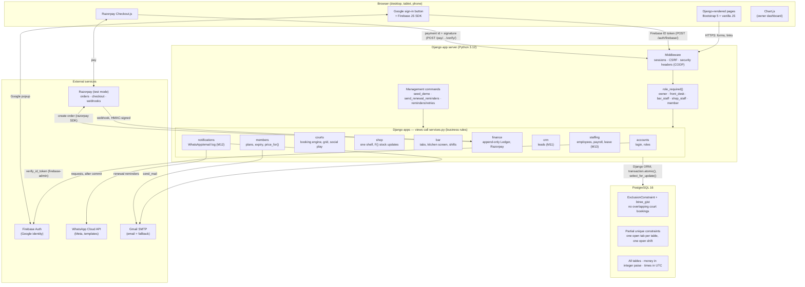
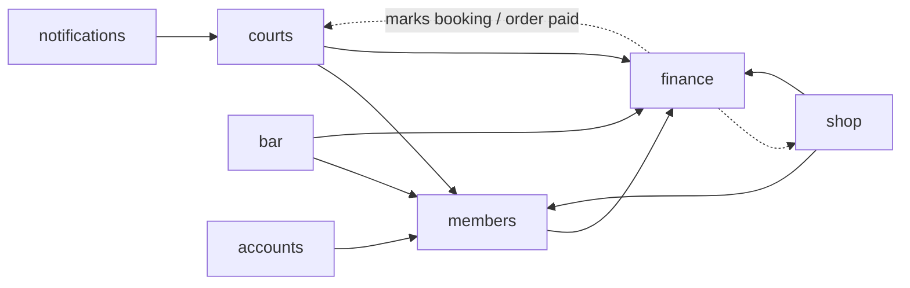

# Architecture — Champions Club Platform

One Django project (a *modular monolith*): one deployable, one PostgreSQL database, small apps with clear jobs.
Server-rendered pages (Django templates + Bootstrap) with a little vanilla JavaScript. No separate frontend app.

## Technology diagram



## How the apps depend on each other



- `members.pricing.price_for()` is the one pricing function (courts, shop, bar).
- `finance.services` is the only code that writes `Ledger` rows (payments +, refunds/expenses −).

## Request flow: booking a court

```mermaid
sequenceDiagram
  participant Staff as Front desk (browser)
  participant View as courts.views
  participant Svc as courts.services.book_court
  participant Pg as PostgreSQL
  participant Fin as finance.services

  Staff->>View: POST /desk/book/new/ (court, start, member phone, paid by)
  View->>View: role_required + form validation
  View->>Svc: book_court(...)
  Svc->>Pg: BEGIN; SELECT member FOR UPDATE (daily-limit lock)
  Svc->>Pg: count today's confirmed bookings (max 2)
  Svc->>Svc: price_for("court", ...) incl. free hours
  Svc->>Pg: INSERT booking  (ExclusionConstraint checks overlap)
  alt overlap
    Pg-->>Svc: IntegrityError
    Svc-->>View: SlotTaken("Court 1 is taken at 18:30...")
  else ok
    Svc->>Fin: record_payment(court, cash, amount)
    Fin->>Pg: INSERT ledger row
    Svc->>Pg: COMMIT (booking + money together)
    Svc-->>View: booking
  end
```

## Technology choices

| Layer | Choice | Why | Rejected |
|---|---|---|---|
| Web framework | Django 6 | Batteries included (ORM, admin, auth, forms, CSRF); easy to explain | FastAPI + React: two codebases, more to defend |
| Database | PostgreSQL 16 | Exclusion constraints, partial unique indexes, row locks | SQLite/MySQL: no exclusion constraints |
| UI | Django templates + Bootstrap 5 | Server-rendered, fast, mobile-friendly, no build step | SPA framework: extra complexity |
| Login | Google via Firebase Auth | No passwords stored; verified server-side | Own password login: more risk |
| Payments | Razorpay (test mode) | India-first: UPI, cards; signed webhooks | Stripe: weaker UPI support |
| Messages | WhatsApp Cloud API + Gmail SMTP | Members live on WhatsApp; email as fallback | SMS gateway: cost, no templates |
| Analytics | pandas + Chart.js | Simple, well known | BI tool: overkill |
| Background work | `transaction.on_commit` + Vercel Cron calling `/cron/<job>/` (management commands locally) | No extra servers | Celery + Redis: not needed at this size |
| Hosting | Vercel (zero-config Django, serverless) + Neon Postgres | Free tier, deploys from GitHub, CDN for static files, cron built in; Neon is serverless Postgres with btree_gist | Self-managed VM; Render (needs gunicorn + whitenoise) |
